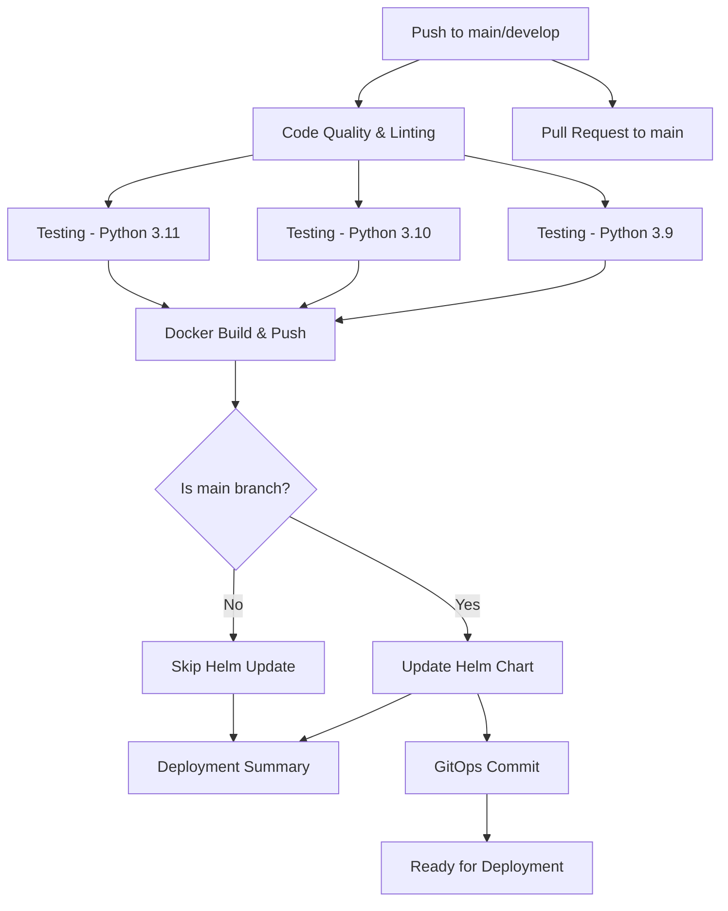

# Currency Converter CI/CD Pipeline Summary

## 🚀 Overview

This GitHub Actions pipeline provides a complete CI/CD solution for the Currency Converter application, implementing GitOps practices with automated testing, Docker image building, and Helm chart management.

## 📋 Pipeline Components

### **1. Code Linting**
- **Tools Used**: flake8, pylint
- **Purpose**: Ensures code quality and consistency
- **Actions**:
  - Performs static analysis with flake8 and pylint
  - Fails pipeline if critical issues are found

### **2. Testing**
- **Framework**: pytest with coverage reporting
- **Scope**: Unit tests across multiple Python versions (3.9, 3.10, 3.11)
- **Features**:
  - Runs comprehensive unit tests for all API endpoints
  - Generates coverage reports
  - Uploads coverage to Codecov
  - Uses pip caching for faster builds

### **3. Docker Image Build & Push**
- **Registry**: GitHub Container Registry (ghcr.io)
- **Features**:
  - Multi-stage builds with BuildKit
  - Automatic tagging strategy (branch, SHA, latest)
  - Layer caching for performance
  - Automated testing of built images
  - Only pushes on main/develop branches (not PRs)

### **4. Helm Chart Updates**
- **Automation**: Automatic chart updates with new image tags
- **Features**:
  - Updates `values.yaml` with new image repository and tag
  - Bumps chart version automatically
  - Updates `appVersion` to match image tag
  - Validates chart with `helm lint` and template rendering
  - Commits changes back to repository (GitOps)

### **5. Deployment Summary**
- **Reporting**: GitHub Action summary with pipeline results
- **Information Provided**:
  - Pipeline status for each stage
  - Built image tags and references
  - Next deployment steps
  - Feature overview

## 🔄 Pipeline Flow



## 🎯 Trigger Conditions

### **Automatic Triggers**
- **Push to `main`**: Full pipeline including Helm chart updates
- **Push to `develop`**: Testing and Docker build (no Helm updates)
- **Pull Request to `main`**: Testing and validation (no image push)

### **Manual Triggers**
- Can be triggered manually via GitHub Actions UI
- Supports workflow dispatch for custom runs

## 📦 Image Tagging Strategy

The pipeline uses a sophisticated tagging strategy:

1. **Branch-based tags**: `main`, `develop`
2. **SHA-based tags**: `main-a1b2c3d`, `develop-x8y9z0a`
3. **Latest tag**: Only for main branch
4. **PR tags**: `pr-123` for pull requests

Example tags generated:
```
ghcr.io/username/repo/currency-converter:main
ghcr.io/username/repo/currency-converter:main-a1b2c3d
ghcr.io/username/repo/currency-converter:latest
```

## 🛠 Helm Chart Management

### **Automatic Updates**
When code is pushed to `main`, the pipeline:

1. **Extracts** the new image tag from the Docker build
2. **Updates** `helm/currency-converter/values.yaml`:
   ```yaml
   image:
     repository: ghcr.io/username/repo/currency-converter
     tag: "main-a1b2c3d"  # ← Updated automatically
   ```
3. **Bumps** chart version in `Chart.yaml`:
   ```yaml
   version: 0.1.1  # ← Incremented
   appVersion: "main-a1b2c3d"  # ← Updated to match image
   ```
4. **Validates** the chart with `helm lint`
5. **Commits** changes back to the repository

### **GitOps Workflow**
The pipeline implements GitOps by:
- Storing all configuration in Git
- Using Git commits as the source of truth
- Automatically updating deployment manifests
- Providing audit trail of all changes

## 🔒 Security Features

### **Container Registry Authentication**
- Uses GitHub token for authentication
- No manual credential management required
- Scoped to repository permissions

### **Image Security**
- Multi-stage builds reduce attack surface
- Non-root user execution
- Regular base image updates
- Vulnerability scanning ready

## 📊 Monitoring & Observability

### **Pipeline Monitoring**
- GitHub Actions status badges
- Detailed logging for each step
- Error reporting and notifications
- Coverage tracking with Codecov

### **Deployment Tracking**
- Git commit history for deployments
- Image tag traceability
- Helm chart version tracking
- Automated deployment summaries

## 🚀 Deployment Workflow

After the pipeline completes successfully:

### **Staging Deployment**
```bash
# Deploy to staging environment
helm upgrade --install staging ./helm/currency-converter \
  --namespace staging --create-namespace
```

### **Production Deployment**
```bash
# Deploy to production with custom values
helm upgrade --install production ./helm/currency-converter \
  --namespace production \
  --values production-values.yaml
```

### **Rollback Capability**
```bash
# Rollback to previous version
helm rollback production 1
```

## 📋 Pipeline Configuration

### **Environment Variables**
- `PYTHON_VERSION`: Python version for testing (3.11)
- `REGISTRY`: Container registry URL (ghcr.io)
- `IMAGE_NAME`: Docker image name (currency-converter)

### **Required Secrets**
- `GITHUB_TOKEN`: Automatically provided by GitHub Actions
- No additional secrets required for basic functionality

### **Optional Configurations**
- Custom registry (Docker Hub, AWS ECR, etc.)
- Additional notification channels
- Custom deployment environments
- Enhanced security scanning

## 🎉 Benefits

### **For Developers**
- ✅ Automated code quality checks
- ✅ Fast feedback on pull requests
- ✅ Automated testing across Python versions
- ✅ No manual deployment steps

### **For Operations**
- ✅ GitOps workflow for deployments
- ✅ Automated image building and tagging
- ✅ Helm chart version management
- ✅ Audit trail of all changes

### **For Business**
- ✅ Faster time to market
- ✅ Reduced deployment risks
- ✅ Consistent code quality
- ✅ Reliable release process

## 🔮 Future Enhancements

Potential improvements for the pipeline:

1. **Multi-environment deployments** (dev, staging, prod)
2. **Automated security scanning** (Trivy, Snyk)
3. **Performance testing** integration
4. **Slack/Teams notifications**
5. **Blue-green deployment** strategies
6. **Canary releases** with Flagger
7. **Cost optimization** with spot instances

This pipeline provides a solid foundation for modern DevOps practices while maintaining simplicity and reliability.