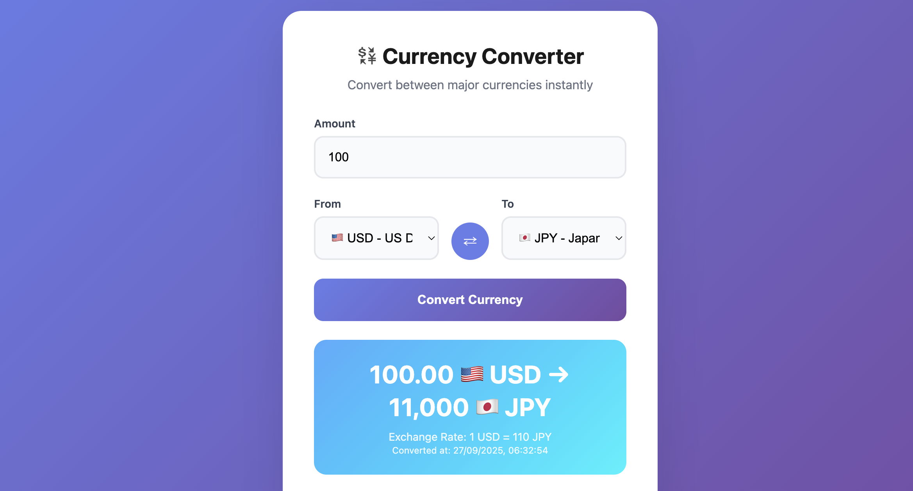

# Currency Converter Application - DevOps Demo

A full-stack currency converter application demonstrating modern DevOps practices including containerization, Kubernetes deployment, Infrastructure as Code (IaC), GitOps, and CI/CD automation.



## 📋 Table of Contents

- [Prerequisites](#prerequisites)
- [Local Development Setup](#local-development-setup)
- [Docker Deployment](#docker-deployment)
- [Kubernetes with Helm](#kubernetes-with-helm)
- [Infrastructure as Code (IaC)](#infrastructure-as-code-iac)
- [GitOps with ArgoCD](#gitops-with-argocd)
- [CI/CD Pipeline](#cicd-pipeline)
- [Testing](#testing)
- [Using the Application](#using-the-application)
- [Architecture Overview](#architecture-overview)

## 🔧 Prerequisites

Before starting, ensure you have the following installed on your machine:

### Required Software

1. **Python 3.11+**
   ```bash
   # Check version
   python3 --version
   
   # Install on macOS
   brew install python@3.11
   
   # Install on Ubuntu/Debian
   sudo apt update && sudo apt install python3.11 python3.11-venv
   ```

2. **Docker Desktop**
   ```bash
   # Download from https://www.docker.com/products/docker-desktop/
   # Or install via brew on macOS
   brew install --cask docker
   
   # Verify installation
   docker --version
   docker info
   ```

3. **Kind (Kubernetes in Docker)**
   ```bash
   # Install on macOS
   brew install kind
   
   # Install on Linux
   curl -Lo ./kind https://kind.sigs.k8s.io/dl/v0.20.0/kind-linux-amd64
   chmod +x ./kind && sudo mv ./kind /usr/local/bin/kind
   
   # Verify installation
   kind --version
   ```

4. **kubectl**
   ```bash
   # Install on macOS
   brew install kubectl
   
   # Install on Linux
   curl -LO "https://dl.k8s.io/release/$(curl -L -s https://dl.k8s.io/release/stable.txt)/bin/linux/amd64/kubectl"
   chmod +x kubectl && sudo mv kubectl /usr/local/bin/
   
   # Verify installation
   kubectl version --client
   ```

5. **Helm**
   ```bash
   # Install on macOS
   brew install helm
   
   # Install on Linux
   curl https://raw.githubusercontent.com/helm/helm/main/scripts/get-helm-3 | bash
   
   # Verify installation
   helm version
   ```

6. **Terraform**
   ```bash
   # Install on macOS
   brew install terraform
   
   # Install on Linux
   curl -fsSL https://apt.releases.hashicorp.com/gpg | sudo apt-key add -
   sudo apt-add-repository "deb [arch=amd64] https://apt.releases.hashicorp.com $(lsb_release -cs) main"
   sudo apt-get update && sudo apt-get install terraform
   
   # Verify installation
   terraform --version
   ```

### Quick Install All (macOS with Homebrew)
```bash
brew install python@3.11 kind kubectl helm terraform
brew install --cask docker
```

## 🚀 Local Development Setup

### Step 1: Clone the Repository
```bash
git clone https://github.com/singhavinash2915/avinash-cognyte-devops-test.git
cd avinash-cognyte-devops-test
```

### Step 2: Set Up Python Virtual Environment
```bash
# Create virtual environment
python3 -m venv venv

# Activate virtual environment
source venv/bin/activate  # On macOS/Linux
# venv\Scripts\activate   # On Windows
```

### Step 3: Start the Backend API
```bash
# Navigate to backend directory
cd application/backend

# Install dependencies
pip install -r requirements.txt

# Start the Flask API server
python app.py
```

The backend API will be available at: **http://127.0.0.1:8090**

### Step 4: Start the Frontend (New Terminal)
```bash
# Navigate to frontend directory (from project root)
cd application/frontend

# Start the static file server
python3 server.py
```

The frontend will be available at: **http://127.0.0.1:5000**

### Step 5: Test the Application
1. Open your browser to **http://127.0.0.1:5000**
2. Enter an amount and select currencies
3. Click "Convert" to test the conversion
4. Check the API health at: **http://127.0.0.1:8090/health**

## 🐳 Docker Deployment

### Step 1: Build the Docker Image
```bash
# From project root directory
docker build -t currency-converter .
```

### Step 2: Run the Container
```bash
# Run the container
docker run -d -p 8080:8080 --name currency-converter currency-converter

# Or run in foreground to see logs
docker run -p 8080:8080 --name currency-converter currency-converter
```

### Step 3: Access the Application
- **Application**: http://localhost:8080
- **Health Check**: http://localhost:8080/health

### Step 4: Container Management
```bash
# View logs
docker logs currency-converter

# Stop the container
docker stop currency-converter

# Remove the container
docker rm currency-converter

# Remove the image
docker rmi currency-converter
```

## ⎈ Kubernetes with Helm

### Step 1: Create a Local Kubernetes Cluster
```bash
# Create a simple Kind cluster
kind create cluster --name currency-converter

# Verify cluster
kubectl cluster-info
kubectl get nodes
```

### Step 2: Load Docker Image into Kind
```bash
# Build the image if not already built
docker build -t currency-converter:latest .

# Load image into Kind cluster
kind load docker-image currency-converter:latest --name currency-converter
```

### Step 3: Deploy with Helm
```bash
# Install the Helm chart
helm install currency-converter ./helm/currency-converter

# Check deployment status
kubectl get pods
kubectl get services
```

### Step 4: Access the Application
```bash
# Port forward to access the application
kubectl port-forward svc/currency-converter 8080:80

# Access at: http://localhost:8080
```

### Step 5: Helm Management
```bash
# Upgrade deployment
helm upgrade currency-converter ./helm/currency-converter

# Uninstall deployment
helm uninstall currency-converter

# Delete cluster
kind delete cluster --name currency-converter
```

## 🏗️ Infrastructure as Code (IaC)

### Step 1: Ensure Prerequisites
```bash
# Verify all tools are installed
docker --version
terraform --version
kind --version
kubectl version --client
```

### Step 2: Create Multi-Node Kubernetes Cluster
```bash
# Create cluster with ArgoCD and metrics server
./infrastructure/scripts/setup-cluster.sh

# The script will:
# - Create 1 master + 1 worker node cluster
# - Install ArgoCD for GitOps
# - Install metrics server for monitoring
# - Generate kubeconfig file
```

### Step 3: Validate the Infrastructure
```bash
# Run comprehensive validation tests
./infrastructure/scripts/validate-cluster.sh

# The validation includes:
# ✅ Cluster connectivity
# ✅ Node count and roles
# ✅ System pods health
# ✅ ArgoCD installation
# ✅ Metrics server operation
# ✅ Network connectivity
```

### Step 4: Access the Cluster
```bash
# Set kubectl context
export KUBECONFIG=./infrastructure/terraform/kubeconfig

# Check cluster status
kubectl cluster-info
kubectl get nodes -o wide
kubectl get pods --all-namespaces
```

### Step 5: Custom Configuration (Optional)
```bash
# Create custom configuration
cp infrastructure/terraform/terraform.tfvars.example infrastructure/terraform/terraform.tfvars

# Edit the file to customize:
# - cluster_name
# - kubernetes_version
# - enable/disable ArgoCD
# - enable/disable metrics server

# Apply changes
./infrastructure/scripts/teardown-cluster.sh --force
./infrastructure/scripts/setup-cluster.sh
```

## 🔄 GitOps with ArgoCD

### Step 1: Access ArgoCD UI
```bash
# Set kubectl context
export KUBECONFIG=./infrastructure/terraform/kubeconfig

# Port forward ArgoCD server
kubectl port-forward svc/argocd-server -n argocd 8080:443

# Get admin password
kubectl -n argocd get secret argocd-initial-admin-secret -o jsonpath='{.data.password}' | base64 -d
```

### Step 2: Access ArgoCD Dashboard
1. Open browser to: **https://localhost:8080**
2. **Username**: `admin`
3. **Password**: Use the password from Step 1
4. Accept the self-signed certificate warning

### Step 3: Deploy Application via GitOps
```bash
# Deploy the ArgoCD application configuration
kubectl apply -f argocd/currency-converter-app.yaml

# Monitor deployment
kubectl get applications -n argocd
kubectl get pods -n currency-converter -w
```

### Step 4: Verify GitOps Workflow
1. **Check Application Status**: In ArgoCD UI, you should see the `currency-converter` application
2. **Sync Status**: Should show "Synced" and "Healthy"
3. **Auto-sync**: Any changes to the Git repository will automatically deploy

### Step 5: Test GitOps (Optional)
```bash
# Make a change to helm/currency-converter/values.yaml
# For example, change replicaCount from 1 to 3

# Commit and push changes
git add .
git commit -m "Scale to 3 replicas"
git push

# Watch ArgoCD automatically detect and deploy changes
kubectl get pods -n currency-converter -w
```

## 🚢 CI/CD Pipeline

### Overview
The project includes a comprehensive GitHub Actions CI/CD pipeline in `.github/workflows/ci.yml`.

### Pipeline Stages
1. **Code Quality**: linting with flake8 and pylint
2. **Security**: vulnerability scanning with bandit and safety
3. **Unit Testing**: comprehensive test suite with coverage
4. **Docker Build**: containerization and image building
5. **Integration Testing**: full application testing
6. **Helm Testing**: Kubernetes deployment validation
7. **Performance Testing**: load testing with Apache Bench
8. **Deployment**: automatic deployment on main branch

### Manual Pipeline Testing
```bash
# Run the complete CI/CD pipeline locally
./application/tests/ci_runner.sh

# Run specific stages
./application/tests/ci_runner.sh unit        # Unit tests only
./application/tests/ci_runner.sh docker      # Docker build and test
./application/tests/ci_runner.sh integration # Integration tests
./application/tests/ci_runner.sh helm        # Helm chart testing
```

### Pipeline Configuration
The pipeline automatically triggers on:
- **Push to main/develop**: Full pipeline including deployment
- **Pull Requests**: All tests except deployment
- **Manual trigger**: Via GitHub Actions UI

### Viewing Pipeline Results
1. Go to your GitHub repository
2. Click on the "Actions" tab
3. View pipeline runs and detailed logs
4. Check test reports and coverage

## 🧪 Testing

### Unit Tests
```bash
# Navigate to tests directory
cd application/tests

# Install test dependencies
pip install -r requirements.txt

# Run all unit tests
pytest -v

# Run with coverage
pytest --cov=../backend --cov-report=html --cov-report=term-missing

# View coverage report
open htmlcov/index.html  # macOS
# or visit: application/tests/htmlcov/index.html
```

### Integration Tests
```bash
# Run integration tests (requires Docker)
pytest test_integration_containerized.py -v

# This tests:
# ✅ Docker image builds successfully
# ✅ Container starts and becomes healthy
# ✅ All API endpoints work in container
# ✅ Frontend serves correctly
# ✅ Performance benchmarks
```

### Comprehensive Test Suite
```bash
# Run complete test suite with reports
python run_tests.py --all --coverage --html

# Quick tests only
python run_tests.py --quick

# Setup test environment
python run_tests.py --setup
```

### Manual API Testing
```bash
# Health check
curl http://127.0.0.1:8090/health

# Currency conversion
curl -X POST http://127.0.0.1:8090/api/convert \
  -H "Content-Type: application/json" \
  -d '{"amount": 100, "from": "USD", "to": "EUR"}'

# Exchange rates
curl "http://127.0.0.1:8090/api/rates?base=USD"

# API information
curl http://127.0.0.1:8090/api/info
```

## 💻 Using the Application

### Application Screenshot


*The Currency Converter features a clean, modern interface with real-time currency conversion between USD, EUR, GBP, and JPY.*

### Accessing the UI

#### Local Development
- **Frontend**: http://127.0.0.1:5000
- **Backend API**: http://127.0.0.1:8090

#### Docker Container
- **Application**: http://localhost:8080

#### Kubernetes
```bash
# Port forward the service
kubectl port-forward svc/currency-converter 8080:80
# Access at: http://localhost:8080
```

### Using the Currency Converter

1. **Open the Application**
   - Navigate to the application URL in your browser

2. **Select Currencies**
   - **From**: Choose the source currency (USD, EUR, GBP, JPY)
   - **To**: Choose the target currency

3. **Enter Amount**
   - Type the amount you want to convert
   - Supports decimal values (e.g., 123.45)

4. **Convert**
   - Click the "Convert Currency" button
   - View the conversion result

5. **Features**
   - **Swap Currencies**: Click the swap button to reverse currencies
   - **Real-time API**: All conversions happen via REST API
   - **Error Handling**: User-friendly error messages
   - **Responsive Design**: Works on desktop and mobile

### API Endpoints

| Endpoint | Method | Description |
|----------|--------|-------------|
| `/health` | GET | Health check and API status |
| `/api/convert` | POST | Convert currency amounts |
| `/api/rates` | GET | Get exchange rates for a base currency |
| `/api/info` | GET | API information and endpoints |

### Exchange Rates
The application uses hardcoded exchange rates for demonstration:
- **USD to EUR**: 0.85
- **USD to GBP**: 0.73
- **USD to JPY**: 110.0

*Note: In production, these would be fetched from external APIs like Fixer.io or CurrencyAPI*

## 🏗️ Architecture Overview

### Microservices Design
```
├── Backend API (Flask)
│   ├── Currency conversion logic
│   ├── Health checks
│   ├── Error handling
│   └── CORS configuration
│
├── Frontend (Static Web App)
│   ├── HTML/CSS/JavaScript
│   ├── API integration
│   ├── Responsive design
│   └── Error handling
│
└── Infrastructure
    ├── Docker containerization
    ├── Kubernetes deployment
    ├── Helm charts
    ├── Terraform IaC
    └── ArgoCD GitOps
```

### Technology Stack
- **Backend**: Python, Flask, Flask-CORS
- **Frontend**: HTML5, CSS3, Vanilla JavaScript
- **Containerization**: Docker, multi-stage builds
- **Orchestration**: Kubernetes, Helm charts
- **Infrastructure**: Terraform, Kind (local)
- **GitOps**: ArgoCD
- **CI/CD**: GitHub Actions
- **Testing**: pytest, coverage.py, Apache Bench

### Production Considerations
- **Scalability**: Horizontal pod autoscaling configured
- **Security**: Non-root containers, RBAC, network policies
- **Monitoring**: Health checks, metrics server integration
- **Reliability**: Pod disruption budgets, rolling updates
- **Observability**: Structured logging, health endpoints

## 🛠️ Troubleshooting

### Common Issues

1. **Docker not running**
   ```bash
   # Start Docker Desktop
   open -a Docker  # macOS
   sudo systemctl start docker  # Linux
   
   # Verify
   docker info
   ```

2. **Port already in use**
   ```bash
   # Find process using port
   lsof -i :8080
   
   # Kill process
   kill -9 <PID>
   
   # Or use different port
   kubectl port-forward svc/service 8081:80
   ```

3. **Kind cluster issues**
   ```bash
   # Delete and recreate cluster
   kind delete cluster --name currency-converter
   ./infrastructure/scripts/setup-cluster.sh
   ```

4. **ArgoCD access issues**
   ```bash
   # Check ArgoCD pods
   kubectl get pods -n argocd
   
   # Restart port-forward
   kubectl port-forward svc/argocd-server -n argocd 8080:443
   ```

### Reset Everything
```bash
# Complete cleanup and restart
./infrastructure/scripts/teardown-cluster.sh --force --clean-all
docker system prune -f
./infrastructure/scripts/setup-cluster.sh
```

## 📚 Additional Resources

- **Project Repository**: https://github.com/singhavinash2915/avinash-cognyte-devops-test
- **Kind Documentation**: https://kind.sigs.k8s.io/
- **Helm Documentation**: https://helm.sh/docs/
- **ArgoCD Documentation**: https://argo-cd.readthedocs.io/
- **Terraform Documentation**: https://terraform.io/docs/

## 🤝 Contributing

This project demonstrates DevOps practices for technical assessment purposes. For production use, consider:

1. **External API integration** for real-time exchange rates
2. **Database persistence** for rate history
3. **Authentication and authorization**
4. **Enhanced monitoring and logging**
5. **Multi-environment deployment pipelines**

---

**Happy Converting! 💱**